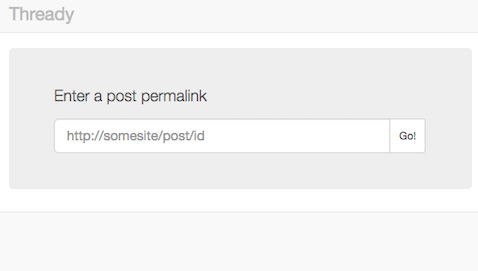
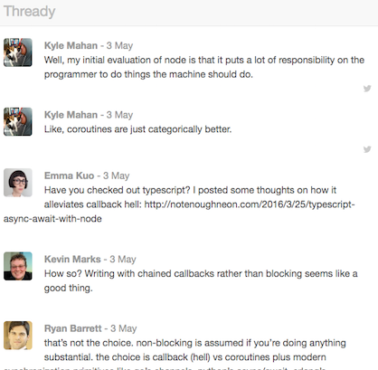

# thready
Indieweb thread reader

Demo for Indieweb Summit 2016 hack day.





## Quick start

Requires node >= 4.0.

```
git clone https://github.com/notenoughneon/thready.git
npm install
typings install
tsc
node build/index.js 8000
```

Then point your browser at localhost:8000.
